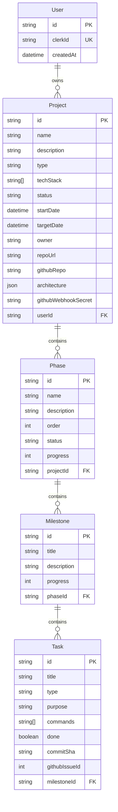
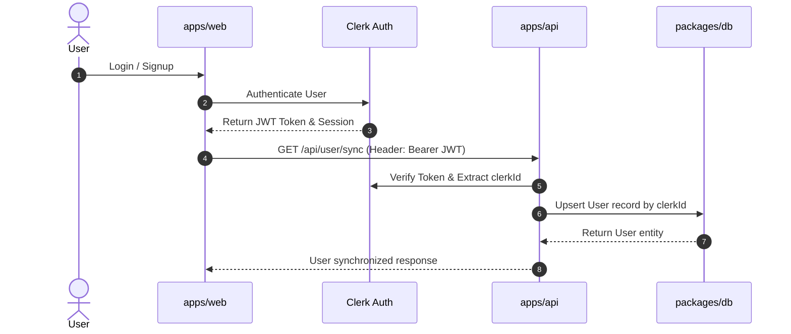
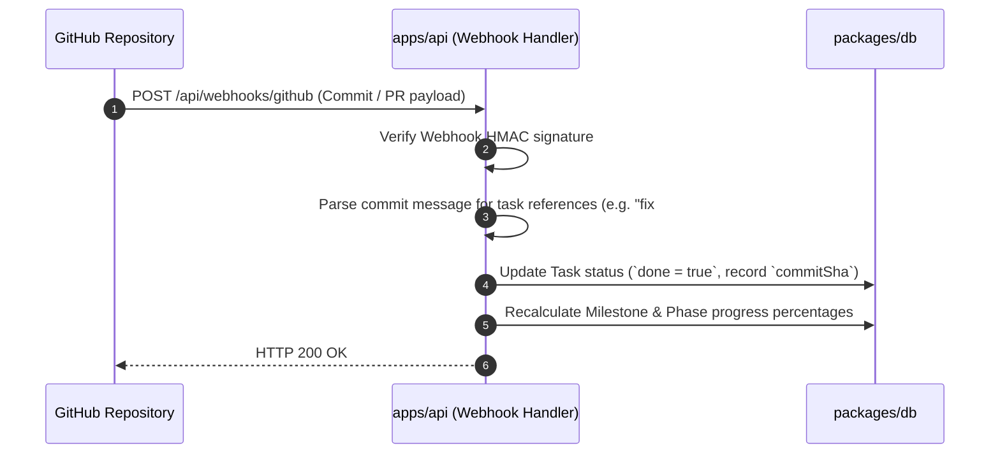

# Velor Architecture Documentation

This document provides a comprehensive technical overview of the architecture, data models, component interactions, and execution pipelines of **Velor**.

---

## 1. Monorepo Overview

Velor uses a modern **Turborepo + pnpm workspaces** architecture. Code, UI components, database definitions, and configurations are modularized across `apps/` and `packages/` to ensure maximum code reusability, isolation, and fast build caching.

```text
                  +-----------------------------------+
                  |           Turborepo              |
                  +-----------------------------------+
                                    |
          +-------------------------+-------------------------+
          |                                                   |
   [Applications]                                      [Packages]
   ├── apps/web (Next.js 16)                           ├── packages/db (Prisma + Neon)
   ├── apps/api (Express 5 REST API)                  ├── packages/ui (Tailwind v4 + Radix)
   └── apps/base (Template App)                        ├── packages/eslint-config
                                                       └── packages/typescript-config
```

---

## 2. Data Model & Prisma Schema

The core relational domain model is defined in `packages/db/prisma/schema.prisma` and deployed via **Neon PostgreSQL**.



---

## 3. Application Subsystems

### 3.1 Next.js Frontend (`apps/web`)

- **Framework**: Next.js 16 (App Router) + React 19
- **State Management**: Redux Toolkit (`@reduxjs/toolkit`, `react-redux`)
- **Authentication**: `@clerk/nextjs` for Client/Server Session token handling
- **UI Components**: Consumes shared `@workspace/ui` design system with Tailwind CSS v4
- **Services**: Custom API fetchers communicating with `apps/api` via Bearer JWTs

### 3.2 Express REST API (`apps/api`)

- **Framework**: Express 5.x
- **Middleware**:
  - `@clerk/express`: Standard authentication & request context validation
  - `cors`: Cross-Origin resource sharing middleware
  - Error Handler: Centralized JSON error formatting and status logging
- **Documentation**: `swagger-ui-express` rendering `openapi.yaml` live at `/docs`
- **AI Service**: Groq SDK (`groq-sdk`) executing fast LLM queries for plan generation

### 3.3 Database Package (`packages/db`)

- **ORM**: Prisma 7 with Neon PostgreSQL adapter (`@prisma/adapter-neon`)
- **Client Generation**: Outputted to local `src/generated` directory for internal monorepo consumption

---

## 4. Key Workflows & Pipelines

### 4.1 Authentication & User Synchronization



### 4.2 AI Project Plan Generation Pipeline

1. User submits project pitch/requirements via Web UI.
2. Web UI invokes backend POST `/api/queries` endpoint.
3. Express service formats prompt and queries Groq LLM (`openai/gpt-oss-120b` or tuned model).
4. Groq returns structured JSON containing project metadata, technical stack recommendations, breakdown phases, milestones, and task commands.
5. Express service saves project structure to Database via Prisma transactions.

### 4.3 Automated GitHub Webhook Task Completion Sync



---

## 5. Security & Environment Configuration

- **Token Protection**: Web-to-API requests utilize Clerk JWT tokens verified in Express middleware.
- **Secrets Isolation**: Secrets are kept out of source code using environment configuration (`.env`) or Doppler secret injection (`doppler run`).
- **Webhooks**: Signature verification (`githubWebhookSecret`) guarantees webhook authenticity.
