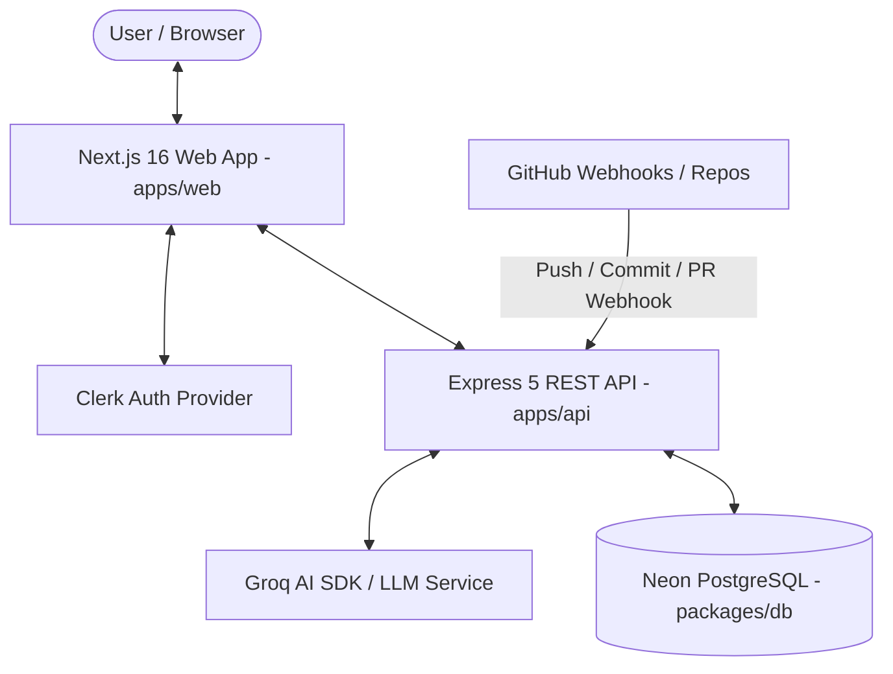

# Velor 🚀

> **AI-Powered Project Management & Automated Developer Execution Engine**

Velor is an intelligent, full-stack monorepo platform designed to streamline developer workflows. By combining Groq LLM inference, dynamic phase/milestone planning, and GitHub webhook event synchronization, Velor automates progress tracking and structures software engineering project lifecycles from concept to commit.

---

## ⚡ Tech Stack


---

## ✨ Key Features

- **🤖 AI Plan Generation**: Leverage Groq's fast LLM models to generate comprehensive project breakdown structures (Phases, Milestones, Actionable Tasks, CLI commands).
- **📊 Real-time Progress Tracking**: Monitor project status with progress bars, phase dependencies, and granular task states.
- **🔄 Automated GitHub Webhook Sync**: Sync commit SHAs and GitHub PR merges directly to task records, updating completion state automatically without manual overhead.
- **🔐 Secure Authentication**: Integrated Clerk authentication across Next.js frontend and Express REST API middleware with user synchronization.
- **📜 OpenAPI 3.0 & Swagger UI**: Built-in Swagger API documentation served live at `/docs` with strict schema validation.
- **📦 Enterprise Monorepo Architecture**: High-efficiency build graph powered by Turborepo with shared UI libraries, Prisma database client, and central ESLint/TypeScript configs.

---

## 🏗️ System Architecture



---

## 📁 Repository Structure

```text
velor/
├── apps/
│   ├── api/                 # Express 5 REST API & Swagger UI server
│   │   ├── src/             # API routes, middleware, services, & controllers
│   │   └── openapi.yaml     # OpenAPI 3.0 specification
│   ├── web/                 # Next.js 16 App Router web application
│   │   ├── app/             # App router pages, project views & layout
│   │   ├── components/      # UI components & dark mode layout
│   │   ├── features/        # Feature modules & Redux state logic
│   │   └── services/        # API client & Groq query integrations
│   └── base/                # Base application placeholder / template
├── packages/
│   ├── db/                  # Prisma ORM schema & Neon PostgreSQL connection package
│   ├── ui/                  # Shared React UI component library (shadcn/ui + Tailwind v4)
│   ├── eslint-config/       # Standardized monorepo ESLint configurations
│   └── typescript-config/   # Shared tsconfig baselines
├── openapi.yaml             # Central OpenAPI specification
├── turbo.json               # Turborepo task pipeline configuration
└── pnpm-workspace.yaml      # Monorepo workspace configuration
```

---

## 🚀 Quick Start & Local Development

### Prerequisites

- **Node.js**: `v20.0.0` or higher
- **pnpm**: `v9.0.0` or higher (`npm i -g pnpm`)
- **PostgreSQL**: Neon PostgreSQL connection URI (or local Postgres instance)
- **Groq API Key**: Obtain from [Groq Console](https://console.groq.com)
- **Clerk Account**: Obtain publishable key and secret key from [Clerk Dashboard](https://dashboard.clerk.com)

### 1. Repository Setup

```bash
git clone https://github.com/[YOUR_GITHUB_USERNAME]/velor.git
cd velor
pnpm install
```

### 2. Environment Variables Configuration

Copy `.env.example` templates to `.env` in the respect apps/packages:

```bash
# Root / API environment configuration
cp .env.example apps/api/.env
cp .env.example apps/web/.env
```

Refer to the [.env.example](file://./.env.example) guide for key configuration requirements.

### 3. Database Migration & Prisma Generation

```bash
# Generate Prisma Client & apply schema migrations
pnpm --filter @workspace/db run generate
```

### 4. Run Development Server

```bash
# Start all micro-apps & backend services via Turborepo
pnpm run dev
```

- **Frontend Application**: `http://localhost:3000`
- **Backend API**: `http://localhost:4000`
- **Swagger API Documentation**: `http://localhost:4000/docs`

---

## 📄 API Documentation

Velor provides interactive OpenAPI documentation for all API routes.

- **Interactive Swagger UI**: Visit `http://localhost:4000/docs` when running the backend API.
- **OpenAPI 3.0 Spec**: Available in JSON format at `/openapi.json` and YAML format at `/openapi.yaml`.

---

## 📚 Repository Documentation

- [ARCHITECTURE.md](file://./ARCHITECTURE.md) – Detailed system architecture, data models, and synchronization flows.
- [CONTRIBUTING.md](file://./CONTRIBUTING.md) – Guidelines for local contribution, code standards, and PR workflows.
- [CHANGELOG.md](file://./CHANGELOG.md) – Version history and feature log.
- [LICENSE](file://./LICENSE) – Open source project license.

---

## 👨‍💻 Author & Contact

**[YOUR_NAME]**
- **Portfolio**: ramansingh.me 
- **LinkedIn**: https://www.linkedin.com/in/ramandeep-singh-503077200
- **Email**: ramandeep01167@gmail.com

---

## 📜 License

This project is licensed under the MIT License – see the [LICENSE](file://./LICENSE) file for details.
